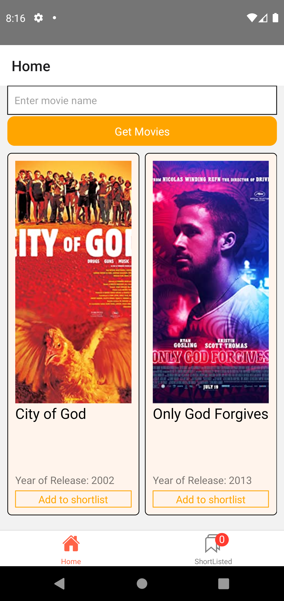
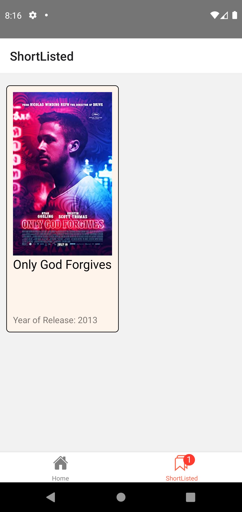

## Generating apk
- Must do from unix shell (like bash) or bash terminal for VS code windows. 

- From project root, run this command:
```
npx react-native run-android --variant=release
```

- The unsigned apk will be found here:   android\app\build\outputs\apk\release\app-release.apk


### A generate apk can be found here:
https://drive.google.com/file/d/1nk8ob-9w9Z7qjYfIhCJLLkizkqYzUaeY/view?usp=sharing

### Screenshots
- Home page  


- Shortlisted page  
